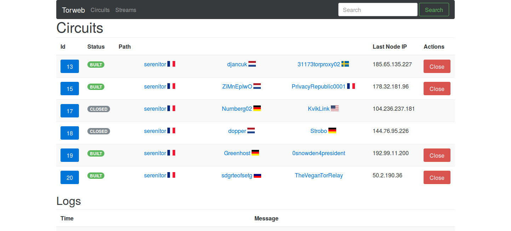
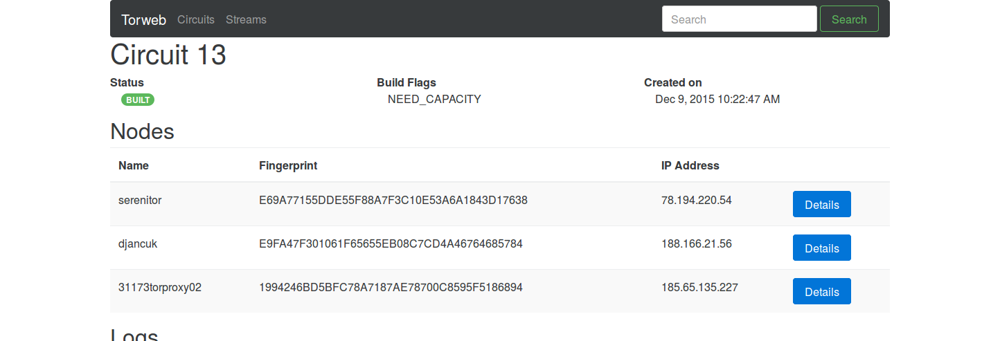
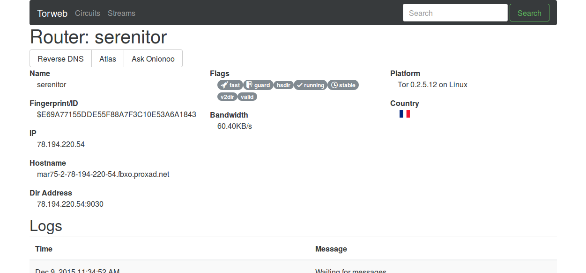
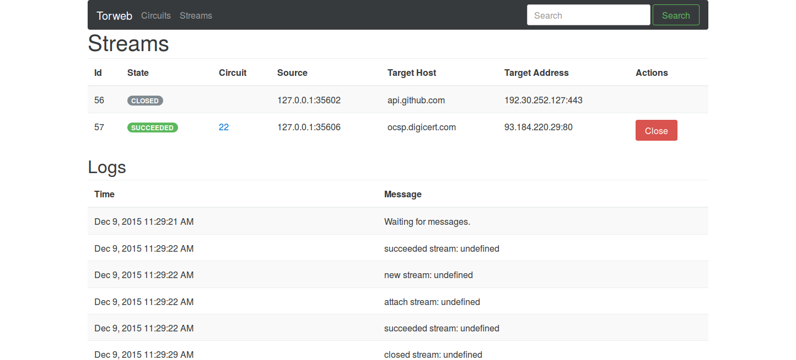

# torweb

Application uses:
 * angular-js
 * twisted
 * autobahn (twisted)
 * txtorcon

## Usage
Clone repository and run:
```sh
./prepare.sh
./run.sh
```
The server should start and run at `127.0.0.1:8082`

## Screenshots
### Circuit List 


### Circuit Details 


### Router Details


### Streams

